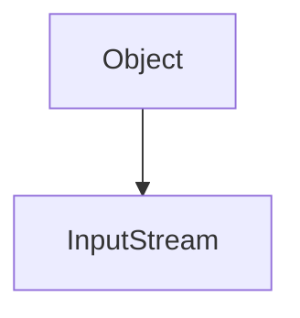

R2022-09-21
Reti di calcolatori: modello architettura le e stack di protocolli allla base di internet 

Protocolli
- routing 

Cos é internet? Inteperoperabilita di multiple reti diverse sia in tipo che in dimensione 

### protocolli :
- regole di comunicazione definito dallo standard IETF
### Componenti di una rete su internet:
- end Device (o sistemi terminali ) (Host):
	- Dispositivi  (pc, smartphone, ecc)
	- Server (di solito in data center)
- Link :
	- Infrastrutture di collegamento
- Dispositivi di interconnessione:
	- Router : connette Una reter a internet 
	- Nore: l internet provider è fatto da solo router e fa da snodo alla connessione 
- Switch: collega gli host al router 
### servizi
- I servizi è ciò che la rete offre al livello applicativi  

# tipi di reti Divisi per grandezza:
- LAN: Local Area network
	- Topologia di comunicazione :
		- BUS (non più usato per problemi di collisione)
		- A Stella  (punto di comunicazione centralizzato, più comune oggi ) 
- WAN: Wide Area Network:
	seve a connettere tra di loro più LAN
	- Topologia di comunicazione:
		- Punto Punto:
		- Commutazione: in comunemente usata da  un internet service provide 
	- Esempi:
		- Rete di Ricerga GARR

# ISP
Per collegare I vari Host c è bisogno di ISP (internet servic pprovider) che danno i percorsi per connettere i diversi host. Per connettere gli ISP  si utilizza degl Internet exchange point che servono per mettere in comunicazione host che si connetto ad ISP diversi. Possono esserci anche delle connessione dirette. c è una gerarchia degli ISP 

(aggiungere foto )

tim Bernal clive Ted X  (vedere per lo standard HTTP)

# livelli di stack 
- Application
- Network 
- Link 

# Modello dati top-Down vs bottom-up
modello a clessidra inserire immagine 

Negli anni la richiesta di stress sulla rete è in aumento (inserire immagine Grafico )

2022-09-22: LABORATORIO 

Gestione Del IO, con JAva.IO basato sul concetto di stream 
- mono direzionale  (ovvero InputStream e OutStream sono separati)
- Accesso FIFO
- di uso generale
- Adatto a trasferire byte e caratteri
- Bloccante (attende sulla I-O se non ci sono Dati)

### motologia:
lo stream di byte di base è pensato per essere estendibile.  Concatenando più stream si puo lavorare a livello più altro rispetto al semplice leggere byte ad esempio con il ==dataInputStream== si può leggere direttamente interi invece che byte

Con il FileOutput-Input Stream

- Per legge da uno stream bisogna usare il metodo read
- Per scrivere byte si usa il medito Write

Con BufferedStream 
- C è un vantaggio in termini di prestazioni 

## Classe blocking queue
	Package: java.until.cuncurrent
	
La blockingQueue È un interfaccia di una coda Thread Safe.
- adatta per il pattern Produttore-Consumatore 
Implementata con :
- ArrayBlockingQueue : Coda limitata è implementata con un array e singolo lock
- LinkedBlokignQueue: Coda _Illimitata_ è implementata con una lista linkata s usa più lock quindi so possono fare operazione sugli elementi concorrentemente

| Throw Exception | Special value | block |
| --------------- | ------------- | ----- |
| add()           | offer()       | put() |                 |               |       |

## ThreadPool Specificabile
- Core pool Size:
	- numero minimo di thread attivi 
	- Attivabile subito con PrestartAllCoreThread()
	- vengono attivati on demand
- MaxPoolSize: Numero massimo di Thread Che possono essere attivato nella thread pool
- KeepLiveTIme: 
	- é un valore in tempo dopo il quale un Thread Inattivo viene ucciso
	- vale per thread _non_ appartenente al Core
		- si può invertire questo comportamento con AllowCoreThreadTimeOut()
- Politica DI Accettazione Task:
	-  Se la coda e piena si puo scegliere cosa fare con i task che arrivano (aggingere un Thread)
	- Si puo implementare un Heandler facendo il tryCatch  prendendo RejectionExecutiionExcepion.

## Altri Tipi di Task Pool
	
_SingleThread: BOH NON L HA DETTO_
ScheduledThreadPool: per operazioni periodiche 

## Chiusura Thread pool
_ShutDown()_: Impedisce di accettare nuovi task
_isTermined()_: controlla che i task sono terminati 

## Scegliere il numero di thread nel threadPool
- Se *CPU-Bound*: conviene avere il numero di thread pari al nume di core 
- se *IO-Bound*: ha senso avere più thread che core siccome alcuni potrebbero andare in attesa 